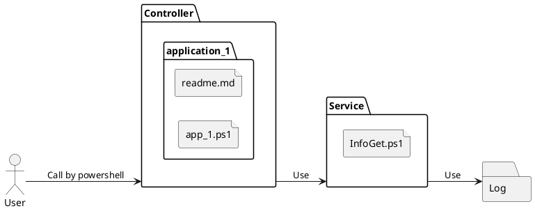

# 概要
業務でpowershellを使うことが多いので、作りました。
後で再利用するために、githubでソース管理します。

#  開発環境

ソフトウェア名|バージョン|説明
------------|--------------|-------
Windows|10|OS
Powershell|5.1.19041| スクリプト言語およびキャラクターユーザーインターフェイス
VSCode|1.99.3|IDE
powershell |2025.0.0| VsCodeエクステンション　Microsoft製

# フォルダ構成

フォルダ名|説明
--------------|-------
Service|ビジネスロジックを書くクラス
Controller|インターフェイス部分(CLI)
Log|ログ関係のクラス

# シーケンス図

#  参考資料